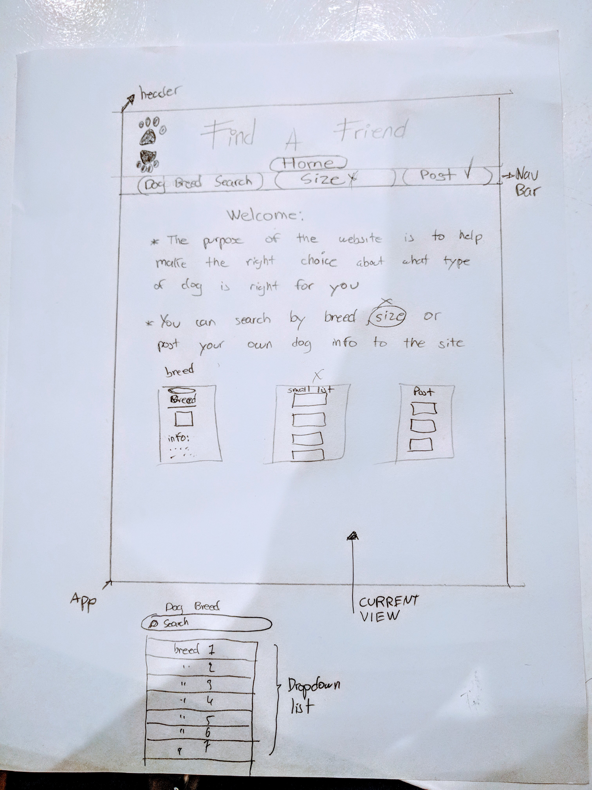

## React Project Two  --Find a Friend--

## Project Description

I want to use the The Dog API to create a website to help make the right choice about what type of dog is right for you.

in the website you can search by breed from a dropdown menu. The information and a picture will be display for that specific choice of breed.

I am also using a second API to get random images for specific breeds. It uses the name of the breed to search the pictures.

## MVP
Users can choose from  a list of breeds and a detail information for that specific breed will show,
including a picture for that breed.

## POST MVP
Add a second page that displays random pictures for each breed.

## Wireframes


## Additional Libraries
-This project was bootstrapped with [Create React App](https://github.com/facebook/create-react-app).
.
-Axios.

## Issues and Resolutions

-Issue: Displaying the information for each breed after the user submits his/her choice
-Resolution: I had to pass each breed id as a prop to make a new axios request using the id:
```
const data = await axios.get(`${BASE_URL}${this.props.breedid}`);
```

-Issue: Displaying an images
-Resolution: Need to import the image:
```
import dogPaw from '../images/dogPaw.png';
```

-Issue: infinite loop when making requested for random pictures
-Resolution: Needed to pass two arguments in componentDidUpdate function:
```
async componentDidUpdate(prevProps, prevState){
  if(this.state.value !== prevState.value){
    const allBreedsData = await axios.get(`${BASE_URL_ALL}`);
    const urls = await RandomPics(this.state.value);
    this.setState(
      {
        allBreeds : allBreedsData.data.message,
        picsUrl : urls
      }
    )}
}
```
[Website link --------- ](nappy-eye.surge.sh)
[Find a Friend video Description ](https://youtu.be/wxp762Z4Ao0)
