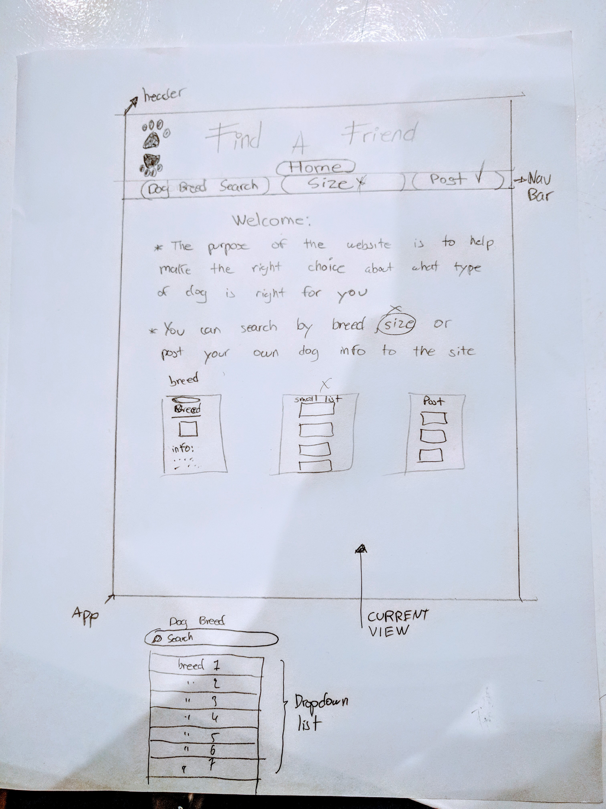

## React Project Two  --Find a Friend--

## Project Description

I want to use the The Dog API to create a website to help make the right choice about what type of dog is right for you.

in the website you can search by breed from a dropdown menu. The information and a picture will be display for that specific choice of breed.

I also want to implement a post your own dog info to the website.

## MVP
Users can choose from  a list of breeds and a detail information for that specific breed will show,
including a picture for that breed.

## POST MVP
Users can post pictures from their dogs along with some information to the website.

## Wireframes


## Additional Libraries
-This project was bootstrapped with [Create React App](https://github.com/facebook/create-react-app).
.
-Axios.

## Issues and Resolutions

-Issue: Displaying the information for each breed after the user submits his/her choice
-Resolution: I had to pass each breed id as a prop to make a new axios request using the id

```const data = await axios.get(`${BASE_URL}${this.props.breedid}`);
```
-Issue: Displaying an images
-Resolution: Need to import the image

```
import dogPaw from '../images/dogPaw.png'
```
